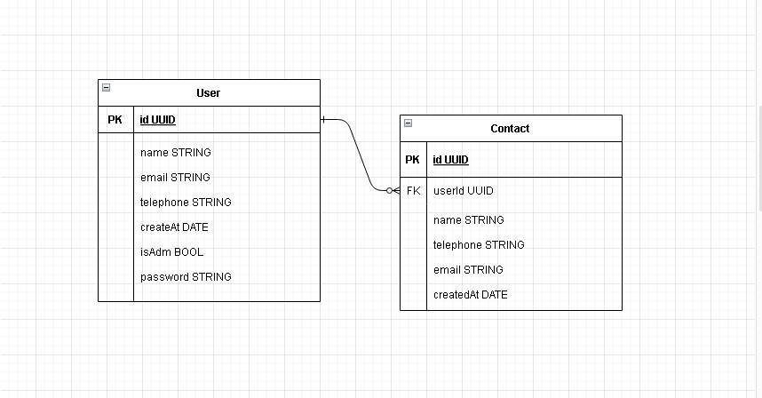

# Aplicação Backend - Contact

## 1. Visão Geral

Visão geral do projeto, um pouco das tecnologias usadas.

- [NodeJS](https://nodejs.org/en/)
- [Express](https://expressjs.com/pt-br/)
- [TypeScript](https://www.typescriptlang.org/)
- [PostgreSQL](https://www.postgresql.org/)
- [TypeORM](https://typeorm.io/)
- [Yup](https://www.npmjs.com/package/yup)

---

## 2. Diagrama ER

[ Ir para o sumário](#tabela-de-conteúdos)

Diagrama ER da API definindo bem as relações entre as tabelas do banco de dados.



---

## 3. Passo a passo para instalação:

### 3.1. Instalando Dependências

Após clonar o repositório, acesse a pasta do projeto Backend, e então execute o comando abaixo:

```bash
yarn
```

### 3.2. Variáveis de Ambiente

Após instalar as dependencias, você deverá criar um arquivo .env e configurá-lo com suas informações:

- Se preferir, você também pode copiar o arquivo .env.example e aterá-lo para .env

```
cp .env.example .env
```

```bash
POSTGRES_USER=
POSTGRES_PWD=
POSTGRES_DB=
SECRET_KEY=
```

Configure suas variáveis de ambiente com suas credenciais do Postgres e uma nova database da sua escolha.

### 3.3. Migrations

Execute as migrations com o comando:

```
yarn typeorm migration:run -d src/data-source.ts
```

### 3.4. Rodando a aplicação

Após isso basta executar o comando abaixo para rodar a aplicação:

```bash
yarn run dev
```

Prontinho, agora você pode seguir para pasta do Frontend.

---
